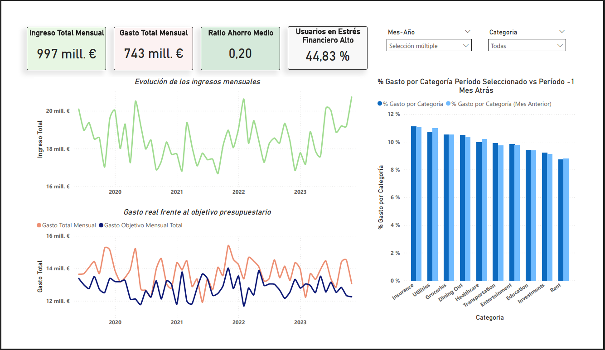

# powerbi-analisis-finanzas-personales
Power BI dashboard para el análisis mensual de la salud financiera personal

# Análisis mensual de finanzas personales (Power BI)

## 📌 Contexto
Dashboard desarrollado en Power BI para analizar ingresos, gastos, ahorro y estrés financiero a nivel mensual.
El proyecto se centra en el respeto de la granularidad del dato, el control del contexto de filtros y
el diseño de visualizaciones coherentes, evitando conclusiones forzadas propias de datasets sintéticos.

## 📊 Dataset
- Origen: Kaggle
- Tipo: Datos sintéticos
- Granularidad: Mensual

## ❓ Preguntas que responde el análisis
- ¿Cómo evolucionan los ingresos y gastos mensuales?
- ¿Cómo se compara el gasto real con el objetivo presupuestario?
- ¿Cómo se distribuye el gasto por categoría?
- ¿Qué proporción de usuarios ha experimentado estrés financiero alto en el periodo seleccionado?

## 🛠️ Decisiones técnicas destacadas
- Uso de tabla DimDate con granularidad mensual
- Control del contexto de filtros mediante DAX
- Segmentadores limitados para evitar selecciones inválidas
- Comparaciones temporales coherentes
- Eliminación consciente de columnas sin semántica clara

## 🧰 Tecnologías
- Power BI
- DAX
- Modelado de datos
- Visualización analítica

## 🖼️ Dashboard

